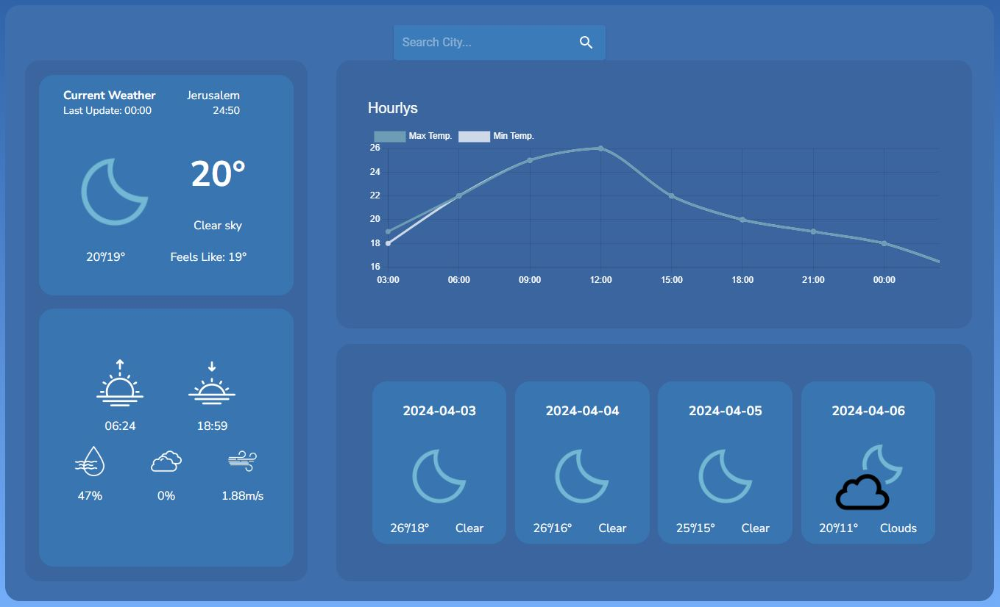
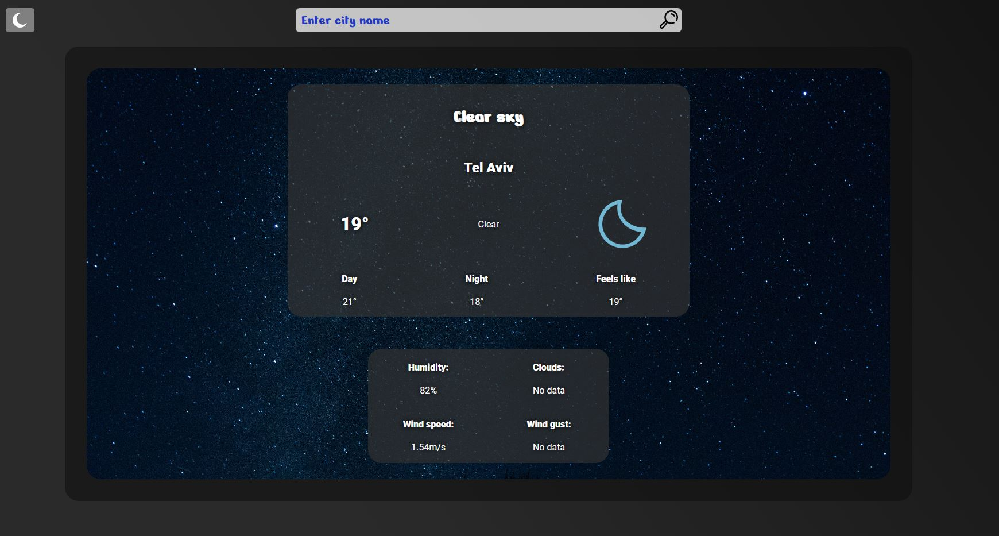
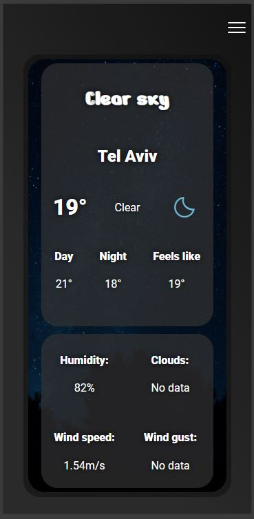
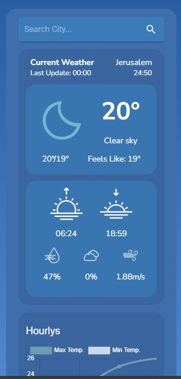

<p align="center">

</p>

<p align="center">


</p>

- [Weather Web App](#weather-web-app)
  - [Demo](#demo)
  - [Installation](#installation)
  - [Example](#example)
  - [Mobile support](#mobile-support)
  - [Site](#site)
    - [Weather Web App V.1 - Desktop](#weather-web-app-v1---desktop)
    - [Weather Web App V.1 - Mobile](#weather-web-app-v1---mobile)
    - [Weather Web App V.2 - Desktop](#weather-web-app-v2---desktop)
    - [Weather Web App V.1 - Mobile](#weather-web-app-v1---mobile-1)

# Weather Web App

<table>
<tr>
<td>
The Weather Web App uses OpenWeather API to display and show future weather for the next few days. The app helps you prepare for leaving home now or a long trip away.

For your attention, there are two versions of the project. The first folder is `weather`, which is to see current day weather. The second folder `weather-v2` is to see the weather for the next few days.
</td>
</tr>
</table>

## Demo
You can see live demo here: https://weather-app-new-phi.vercel.app


## Installation
Please follow the steps to install and setting up the app.

* Get a free API Key at https://openweathermap.org
* Clone the repo
```sh
    git clone https://github.com/RuKatya/Weather-app-new.git
```

Install NPM packages
```sh
   npm install
```

Enter your API Key in App component enstead of `your_api_key`
```js
    await axios.get(`https://api.openweathermap.org/data/2.5/forecast?q=${city}&units=metric&appid=${your_api_key}`)
```
   
## Example
```jsx
const WeatherLittle: FC<IWeatherLittle> = ({ date }) => {
    const getMaxMin = (dateArr: IListObject[]) => {
        const maxTemps = dateArr.map(dt => dt.main.temp_max)
        const minTemps = dateArr.map(dt => dt.main.temp_min)
        const maxTempOfDay = Math.max(...maxTemps).toFixed(0)
        const minTempOfDay = Math.min(...minTemps).toFixed(0)
        return { maxTempOfDay, minTempOfDay }
    }

    const { maxTempOfDay } = getMaxMin(date)
    const { minTempOfDay } = getMaxMin(date)

    return (
        <div className='little-weather'>
            <h4>{date[0].dt_txt.slice(0, 10)}</h4>
            <p>{maxTempOfDay}&deg;/{minTempOfDay}&deg;</p>
            <p>{date[0].weather[0].main}</p>
            
        </div>
    )
}
```

## Mobile support
The Weather Web App is compatible with the following display sizes:
* 360px
* 600px 
* 1200px
* 1900px 

The application's consistent improvements are being made.

## Site
### Weather Web App V.1 - Desktop

<p align="center">

</p>

### Weather Web App V.1 - Mobile
<p align="center">

</p>

### Weather Web App V.2 - Desktop
<p align="center">

</p>
### Weather Web App V.1 - Mobile
<p align="center">

</p>